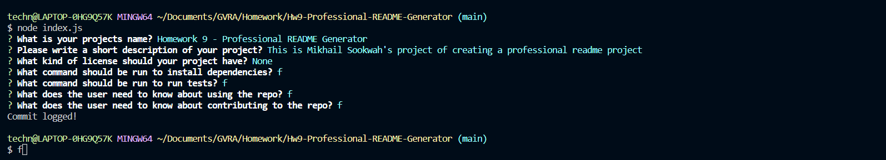
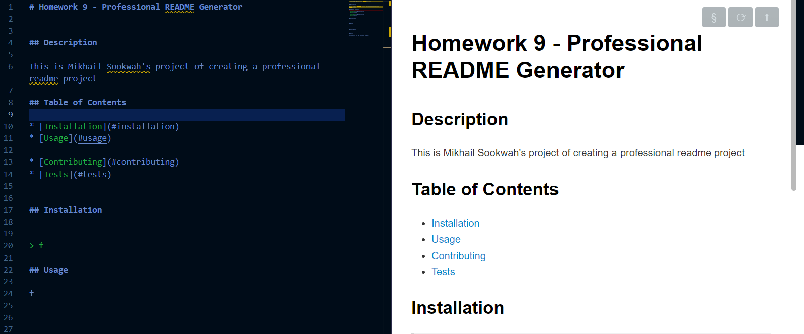
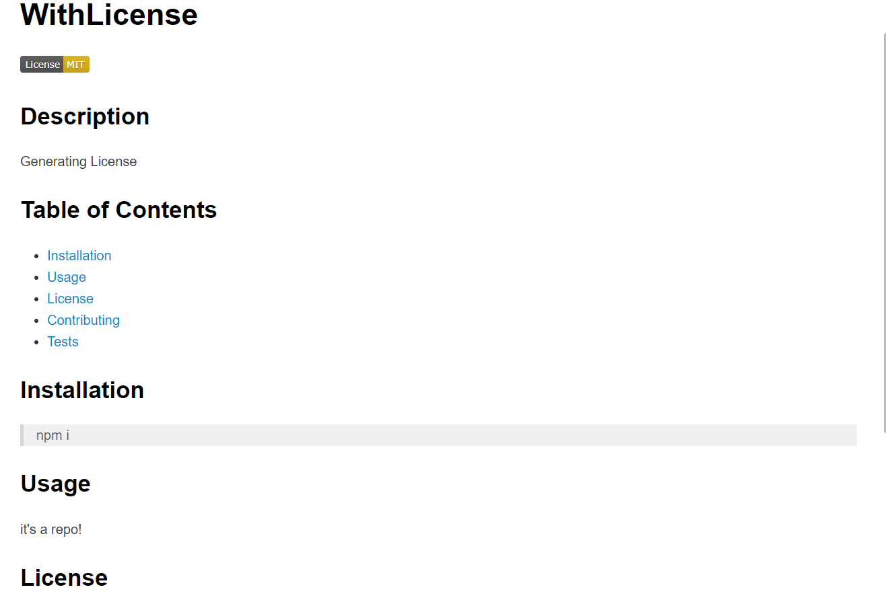
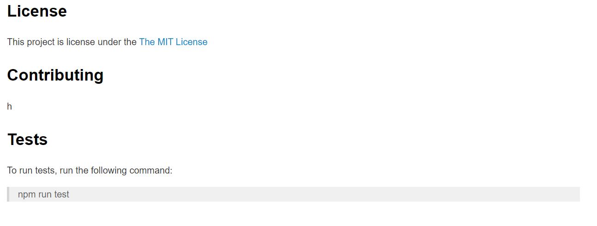

# Homework 9 - Professional README Generator

## Description

This is Mikhail Sookwah's project of creating a professional readme project

This program includes: 

* The inquire installation that allow the use of prompts for customizaation

    * You can enter the title, licenses, description among other functions

    * You also have the option to not use a License object

[Link to the video for instructions](https://drive.google.com/file/d/1qV_QNK72k4Oj8nF7ESAVZWxcS-i36lUu/view?usp=sharing)

